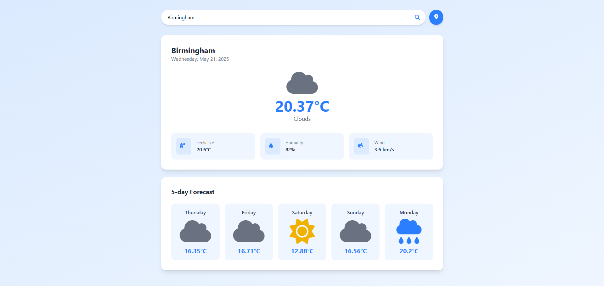

# 🟩 Day 02 - WeatherDashboard

This is the second project of my **100 Days of Code** challenge — a clean and simple Weather App built with Angular and OpenWeatherMap API.

---

## 📦 Tech Stack

- **Frontend**: [Angular](https://angular.io/)
- **Styling**: [Tailwind CSS](https://tailwindcss.com/)
- **Icons**: [Font Awesome](https://fontawesome.com/)
- **API**: [OpenWeatherMap](https://openweathermap.org/api)
- **Geolocation**: [Geolocation API](https://developer.mozilla.org/en-US/docs/Web/API/Geolocation_API)

---

## 📁 Project Structure

```
Day02-WeatherDashboard/
│
└── Client/         # Angular frontend application
```

---

## 🚀 How to Run

### 1. Start the Frontend (Client)

```bash
cd Client
npm install
ng serve
```

Visit the app at: `http://localhost:4200`

---

## ✅ Features

- Clean and responsive UI
- Geolocation-based weather data
- City search functionality
- Real-time weather updates

---

## 📌 Notes

- You need a free API key from OpenWeatherMap.
- The app uses the weather and forecast endpoints.

---

## 🔗 Repository Root

[Back to Main Repo](../..)

---

## 🧠 What I Learned

- How to consume REST APIs with Angular
- Managing user input and state in Angular
- Tailwind CSS for layout and theming
- Using browser Geolocation API

---

Happy coding! 👨‍💻  
Made with ❤️ by [@aheroglu](https://github.com/aheroglu)

## 📸 Preview


