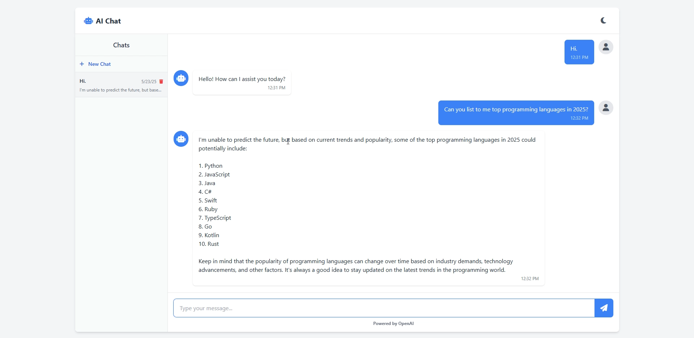

# 🟩 Day 03 - AIChatUI

This is the third project of my **100 Days of Code** challenge — a clean and simple AI Chat App built with Angular and OpenAI API.

---

## 📦 Tech Stack

- **Frontend**: [Angular](https://angular.io/)
- **Styling**: [Tailwind CSS](https://tailwindcss.com/)
- **Icons**: [Font Awesome](https://fontawesome.com/)
- **API**: [OpenAI](https://openai.com/api/)

---

## 📁 Project Structure

```
Day03-AIChatUI/
│
└── Client/         # Angular frontend application
```

---

## 🚀 How to Run

### 1. Start the Frontend (Client)

```bash
cd Client
npm install
ng serve
```

Visit the app at: `http://localhost:4200`

---

## ✅ Features

- Clean and responsive UI
- Real-time chat with AI

---

## 📌 Notes

- You need a free API key from OpenAI.

---

## 🔗 Repository Root

[Back to Main Repo](../..)

---

## 🧠 What I Learned

- Managing user input and state in Angular
- Tailwind CSS for layout and theming
- Using OpenAI API
- Implementing real-time chat functionality

---

Happy coding! 👨‍💻  
Made with ❤️ by [@aheroglu](https://github.com/aheroglu)

## 📸 Preview


