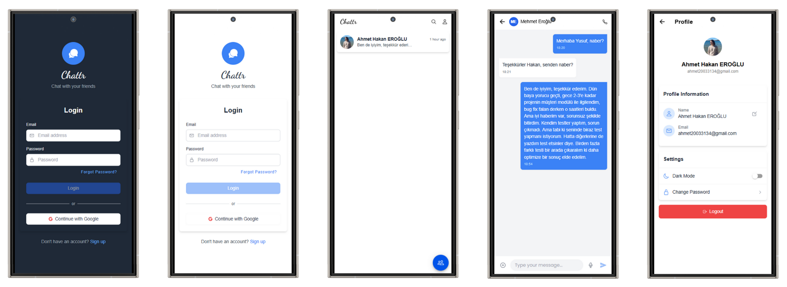

# 🟩 Day 04 - Chattr

This is the fourth project of my **100 Days of Code** challenge — a modern real-time messaging application built with Angular and Firebase.

---

## 📦 Tech Stack

- **Frontend**: [Ionic](https://ionicframework.com/)
- **Styling**: [Tailwind CSS](https://tailwindcss.com/)
- **Icons**: [Ionicons](https://ionicons.com/)
- **Backend and Database**: [Firebase](https://firebase.google.com/)

---

## 📁 Project Structure

```
Day04-Chattr/
│
└── client/         # Ionic frontend application
```

---

## 🚀 How to Run

### 1. Start the Frontend (Client)

```bash
cd client
npm install
ionic serve
```

Visit the app at: `http://localhost:8100`

---

## ✅ Features

- Clean and responsive UI
- Real-time messaging
- Dark/Light theme support
- Responsive design

---

## 📌 Notes

- You need a Firebase account to run this app.
- You need to create a Firebase project and enable the Authentication and Firestore services.
- You need to add your Firebase configuration to the app (client/src/environments/environment.ts).

---

## 🔗 Repository Root

[Back to Main Repo](../..)

---

## 🧠 What I Learned

- Managing user input and state in Angular
- Tailwind CSS for layout and theming
- Using Firebase for authentication and real-time database
- Implementing real-time chat functionality

---

Happy coding! 👨‍💻  
Made with ❤️ by [@aheroglu](https://github.com/aheroglu)

## 📸 Preview


