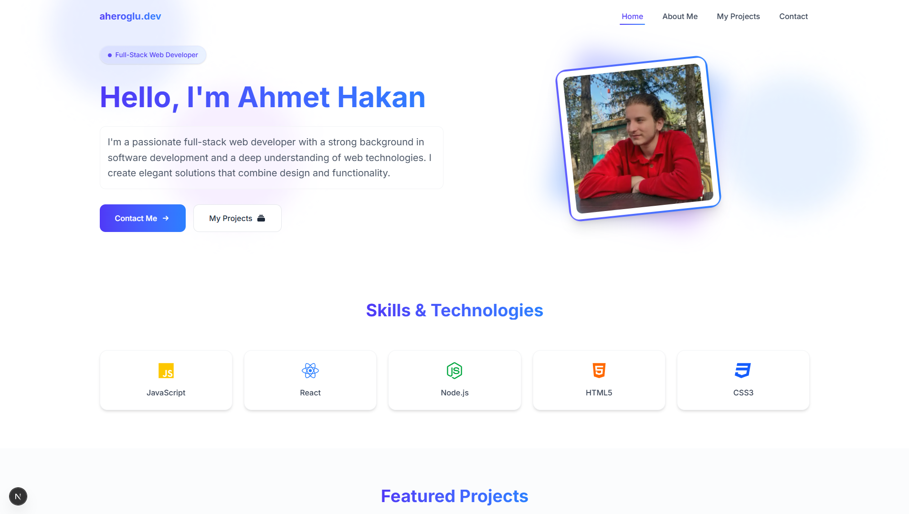

# 🟩 Day 05 - Devfolio

This is the fifth project of my **100 Days of Code** challenge — a modern portfolio website built with Next.js and Tailwind CSS.

---

## 📦 Tech Stack

- **Frontend**: [Next.js](https://nextjs.org/)
- **Styling**: [Tailwind CSS](https://tailwindcss.com/)

---

## 📁 Project Structure

```
Day05-Devfolio/
│
└── portfolio/         # Next.js frontend application
```

---

## 🚀 How to Run

### 1. Start the Frontend (Client)

```bash
cd portfolio
npm install
npm run dev
```

Visit the app at: `http://localhost:3000`

---

## ✅ Features

- Clean and responsive UI
- Dark/Light theme support
- Responsive design

---

##  Repository Root

[Back to Main Repo](../..)

---

## 🧠 What I Learned

- Next.js for frontend development
- React for frontend development
- Tailwind CSS for styling
- Responsive design

---

Happy coding! 👨‍💻  
Made with ❤️ by [@aheroglu](https://github.com/aheroglu)

## 📸 Preview


