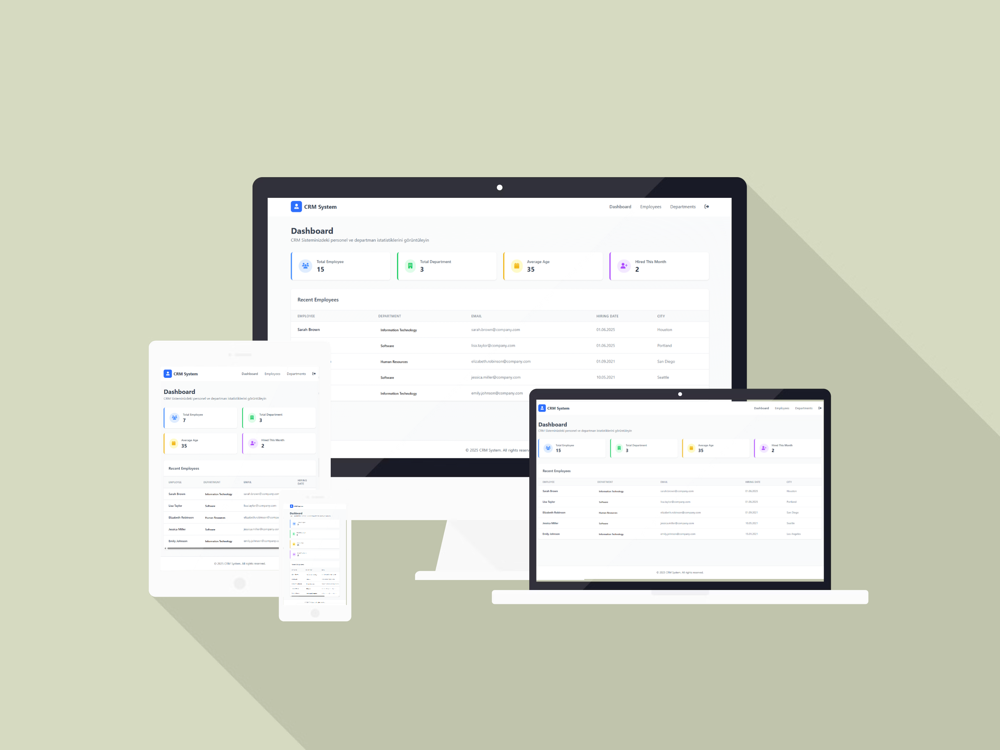

# 🟩 Day 06 - Employee CRM

This is the sixth project of my **100 Days of Code** challenge — a Employee CRM built with .NET Core and Angular.

---

## 📦 Tech Stack

- **Frontend**: [Angular](https://angular.io/)
- **Backend**: [.NET Core](https://dotnet.microsoft.com/)
- **Styling**: [Tailwind CSS](https://tailwindcss.com/)

---

## 📁 Project Structure

```
Day06-EmployeeCRM/
│
└── client/         # Angular frontend application
└── server/         # .NET Core backend application
```

---

## 🚀 How to Run

### 1. Start the Backend (Server)

```bash
cd server
dotnet run
```

### 2. Start the Frontend (Client)

```bash
cd client
npm install
ng serve
```

Visit the app at: `http://localhost:4200`

---

## ✅ Features

- Clean and responsive UI
- Responsive design
- JWT Authentication
- CRUD Operations

---

## 📌 Notes

- You need to fill the appsettings.json file with your own values in the server/src/Server.WebAPI/appsettings.json file.

---

## Repository Root

[Back to Main Repo](../..)

---

## 🧠 What I Learned

- .NET Core for backend development
- Angular for frontend development
- Tailwind CSS for styling
- Responsive design
- JWT Authentication
- CRUD Operations

---

Happy coding! 👨‍💻  
Made with ❤️ by [@aheroglu](https://github.com/aheroglu)

## 📸 Preview


